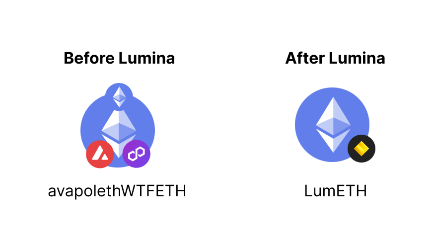
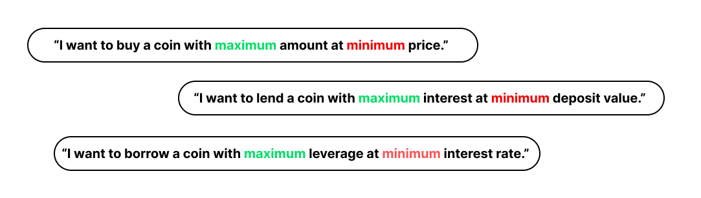

# ✨ Lumina

Lumina is the first Byzantine Fault Tolerant bridge to augment assets across blockchains with fail-safe mechanism. It is the smart contract protocol to pass not only assets, but also any messages or transactions to execute remotely to construct intent.

## Features

### **No more wrapping.**

<figure><figcaption></figcaption></figure>

Get augmented assets only once as derivative by staking, transfer it to every chains.

### Protect your assets from bridge hack with personal account.

<figure><figcaption></figcaption></figure>

Only you can claim back your original assets unlike other bridges with your personal account. Stop from hackers stealing your wealth from hacking other wrapped assets in bridges.

### Lumina is an intent-centric cross-chain middleware.

<figure><figcaption></figcaption></figure>

Lumina is an cross-chain intent platform where it enables users to earn the maximum benefit from minimum cost.&#x20;

### Stake your assets, move derivatives everywhere, get $LUM as reward.

Stake your native coins or tokens to augment into Lum assets, transfer to any network across blockchains.

Expand exposure to capital without permissions, and get $LUM as staking reward for keeping decentralized bridge.

Always claim back your original asset with no worries in your personal account.
