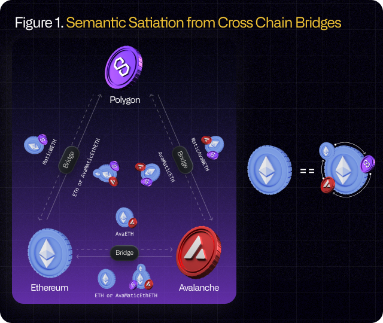
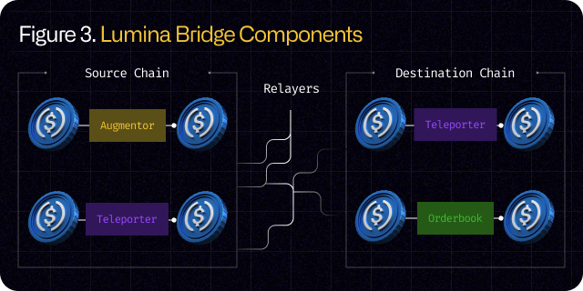

# Augmented Assets

## What Are Augmented Assets?

<figure><figcaption></figcaption></figure>

Augmented assets are the next generation of interoperable asset primitive across blockchains with fail-safe layer. Bridges with lock-and-mint mechanism were hacked to produce oversupply of its wrapped asset from destination chain to claim back real asset then liquidate into cash in centralized exchange.

## Why Use Augmented Assets?&#x20;

<figure><figcaption></figcaption></figure>

It is far more secure to make unified wrapped token for all chains then provide liquidity for native assets than having each different wrapped token depending on from chain to another chain.

<figure><figcaption></figcaption></figure>

Current wrapped tokens by bridges are only able to make duplex value transfer by lock-and-mint. They rely only on AMMs so liquidity is limited, make slippage where users get hurt with financial losses, have massive risks when wrapped tokens is oversupplied and claimed back for original asset, even the one who locks original asset can run away with the locked fund.&#x20;

<figure><figcaption></figcaption></figure>

Instead, Lumina locks asset first with segregating user's asset safely for multiplex value transfer. Only users can turn augmented asset to original asset. Augmented token liquidities are then provided in orderbook exchange, giving always the maximum amount of native asset in minimum cost. The liquidity does not affect the price of the augmented asset and can always be traded at the market rate without significant slippage.
