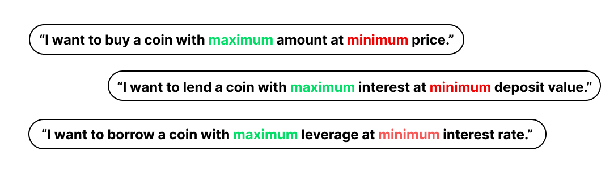

# Intent

## What Is Intent?

<figure><figcaption></figcaption></figure>

Intents are the locally optmial transaction in blockchain to acquire maximum benefit from minimum cost. Lumina's services are intent-centric to provide maximum outcome from minimum cost.&#x20;

## Why Use Intent?

Everyone wants to trade cryptocurrency at the best price. Everyone wants to have minimum loss(cost) to trade the most amount of assets. Similar cases where one borrows or lends comes with the same intentions. Human greed is just set this way. We want maximum outcome with minimum efforts.&#x20;
