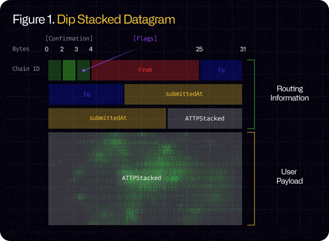

# Omnygram

## What is Omnygram?

<figure><figcaption></figcaption></figure>

Omnygram is the unified datagram standard to communicate between blockchain. It enables to execute transactions across blockchains from bottom-up approach.

A message across blockchain is defined as "_**Stacket**_", representing a packet stacked in blockchain state to be delivered across. The integrity of Stacket is secured by stacked finalized block after its generation in blockchain state.&#x20;

To understand procedure on its generation and delivery, read the [paper](paper.md).

