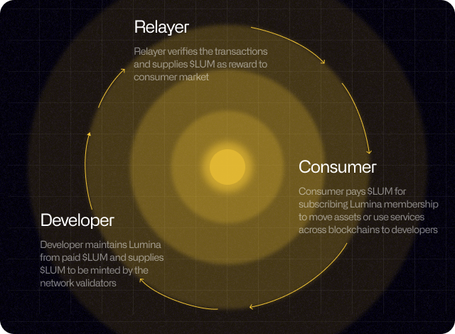

# 🔶 $LUM

$LUM is an asset which powers the economy of interchain communication across blockchains. It has a novel incentive mechanism to sustain its ecosystem with circular tokenomics between its market participants; relayer, developer, consumer.&#x20;

<figure><figcaption>
$LUM economic security
</figcaption></figure>

$LUM tells a story about omnichain experience of new disruptive, liberal, and democratic finance led by innovators in digital finance. It is a token to select assets to connect, power its omnichain infrastructure across blockchains.

$LUM commoditizes trust. Banks sell trust that money in an account is safe until they go bankrupt within its nation. Bitcoin sells trust that your wealth is safe with $BTC in one’s private key until the network stops or become unsustainable regardless of borders. $LUM sells trust that your smart contract account to put digital assets are safe until all its supporting networks become unsustainable or flawed.

