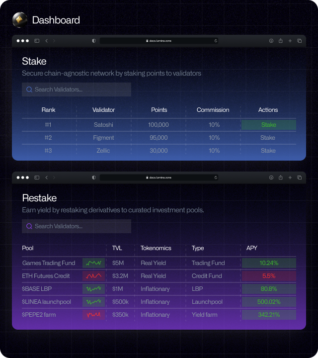

# Restaking

Restaking is enabled in Lumina in that staked assets generate liquid staking derivative. The asset is called as [Augmented Asset](../design/augmented-assets/). Augmented asset as a derivative can freely move across chains connected with Lumina, and this makes a cross-chain investment opportunity. With liquidity formed from multichain, augmented assets can be staked in liquidity pools, money markets, options, or trading funds.&#x20;

<figure><figcaption></figcaption></figure>

Once you stake your native asset and redeem augmented asset, you get point to stake to relayers. Points are used to nominate relayers to deliver cross-chain messages. Relayers are rewarded with $LUM once they relay a message across chain, and the more points &#x20;
