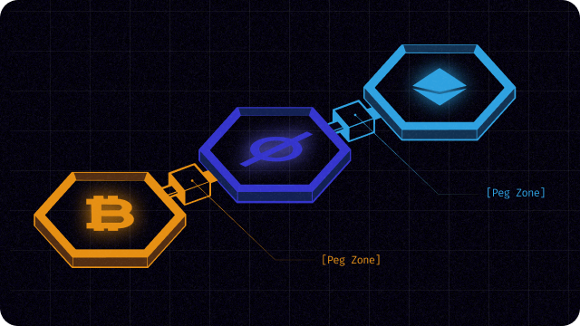

# Introduction

<figure><figcaption></figcaption></figure>

Relayer is an external client to deliver the messages across blockchains. Its idea was first introduced as **Peg Zone** from Cosmos. It was supposed to be a sovereign chain made with Tendermint consensus to deliver cross-chain transactions in decentralized way between heterogeneous blockchains, but it now serves as an external client to deliver IBC standard messages between two Cosmos sovereign chains. Relayer now does not have any incentivization to maintain its node nor its decentralized consensus to remain honest. &#x20;

Lumina's relayer follows the original vision of Cosmos Zone, but with more robust consensus to prevent 2/3 byzantine fault in its underlying technology, [Omnygram](../design/omnygram/). Also, it extends its datagram standard to be adaptable to all kinds of cross-chain transaction format with top-down approach including IBC, XCMP, inscriptions, etc.

